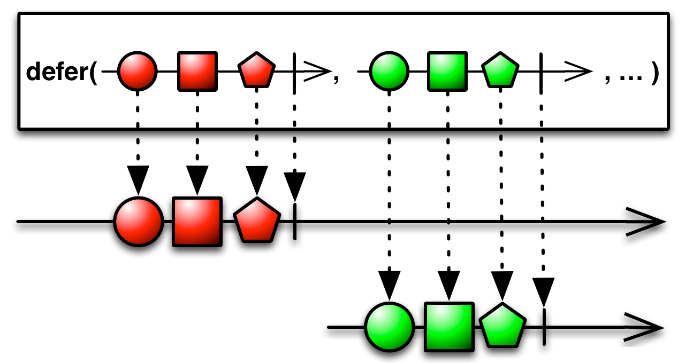
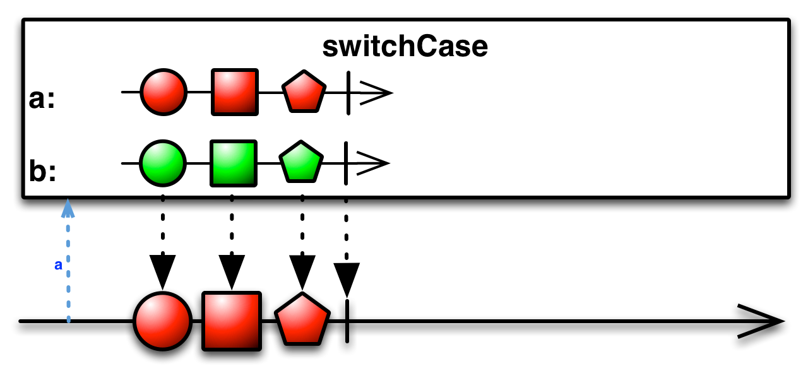
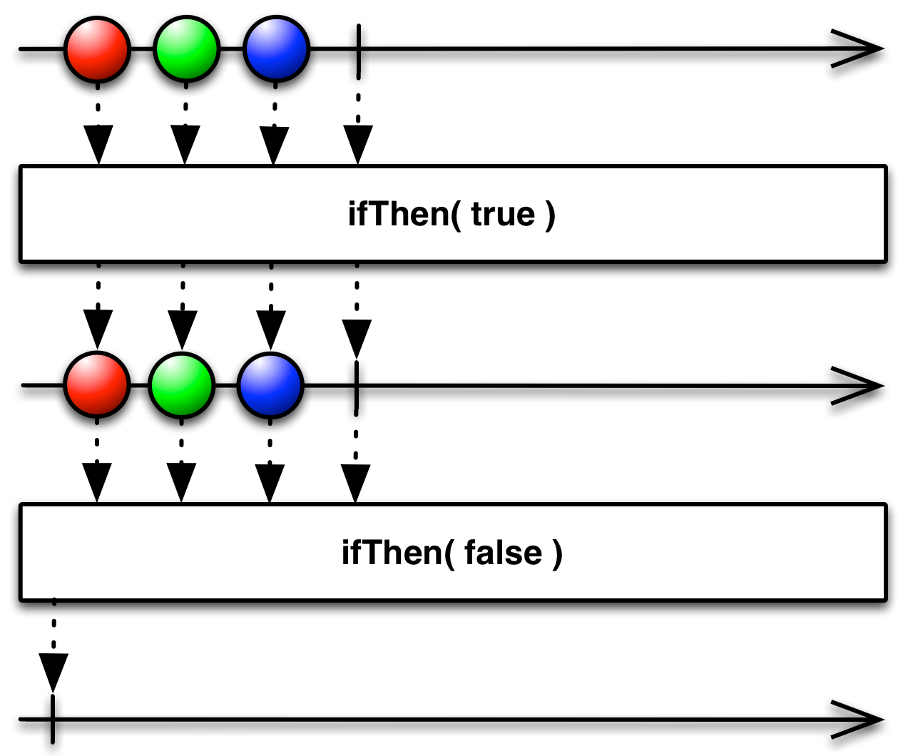

## Defer

直到有观察者订阅时才创建Observable，并且为每个观察者创建一个新的Observable

`Defer`操作符会一直等待直到有观察者订阅它，然后它使用Observable工厂方法生成一个Observable。它对每个观察者都这样做，因此尽管每个订阅者都以为自己订阅的是同一个Observable，事实上每个订阅者获取的是它们自己的单独的数据序列。

在某些情况下，等待直到最后一分钟（就是知道订阅发生时）才生成Observable可以确保Observable包含最新的数据。

RxJava将这个操作符实现为 `defer` 方法。这个操作符接受一个你选择的Observable工厂函数作为单个参数。这个函数没有参数，返回一个Observable。

`defer`方法默认不在任何特定的调度器上执行。

* Javadoc: [`defer(Func0)`](http://reactivex.io/RxJava/javadoc/rx/Observable.html#defer(rx.functions.Func0))

### switchCase

可选包 `rxjava-computation-expressions` 中有一个类似的操作符。`switchCase`操作符有条件的创建并返回一个可能的Observables集合中的一个。

可选包 `rxjava-computation-expressions` 中还有一个更简单的操作符叫`ifThen`。这个操作符检查某个条件，然后根据结果，返回原始Observable的镜像，或者返回一个空Observable。
