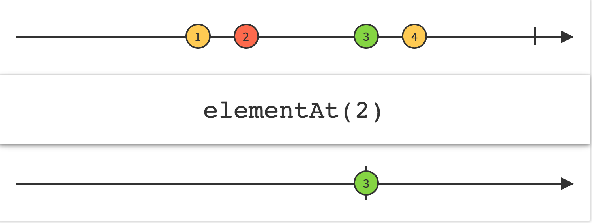
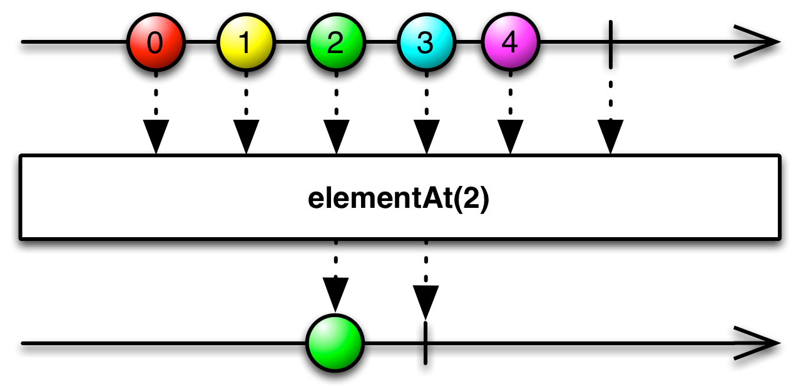
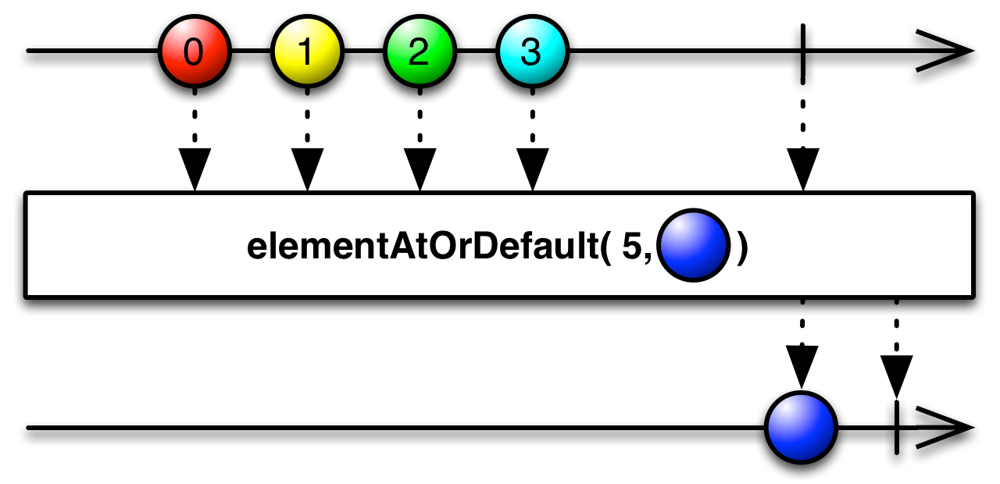

## ElementAt

只发射第N项数据

`ElementAt`操作符获取原始Observable发射的数据序列指定索引位置的数据项，然后当做自己的唯一数据发射。

RxJava将这个操作符实现为`elementAt`，给它传递一个基于0的索引值，它会发射原始Observable数据序列对应索引位置的值，如果你传递给`elementAt`的值为5，那么它会发射第六项的数据。

如果你传递的是一个负数，或者原始Observable的数据项数小于`index+1`，将会抛出一个`IndexOutOfBoundsException`异常。

* Javadoc: [elementAt(int)](http://reactivex.io/RxJava/javadoc/rx/Observable.html#elementAt(int))

### elementAtOrDefault

RxJava还实现了`elementAtOrDefault`操作符。与`elementAt`的区别是，如果索引值大于数据项数，它会发射一个默认值（通过额外的参数指定），而不是抛出异常。但是如果你传递一个负数索引值，它仍然会抛出一个`IndexOutOfBoundsException`异常。

* Javadoc: [elementAtOrDefault(int,T)](http://reactivex.io/RxJava/javadoc/rx/Observable.html#elementAtOrDefault(int,%20T))

`elementAt`和`elementAtOrDefault`默认不在任何特定的调度器上执行。
