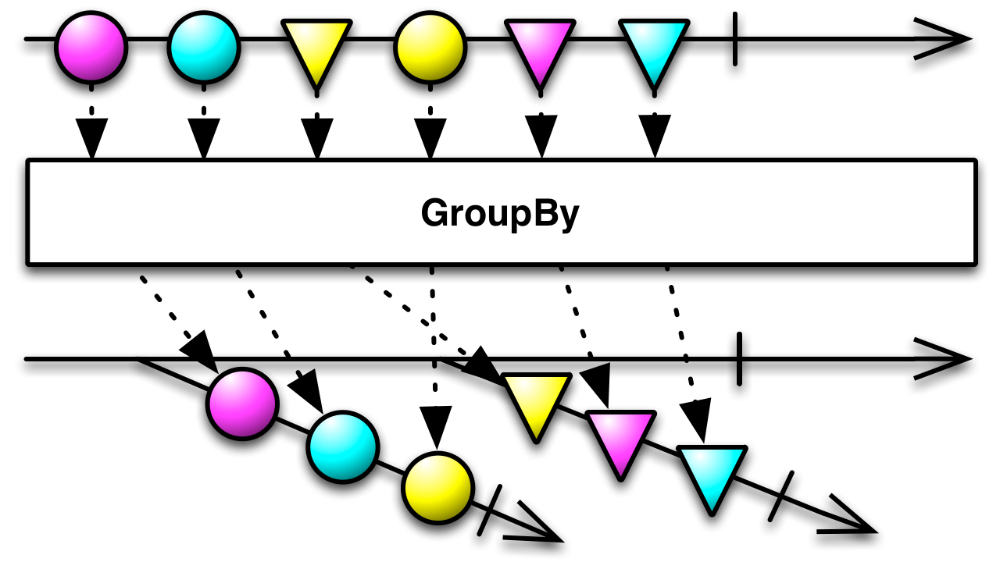

## GroupBy

将一个Observable分拆为一些Observables集合，它们中的每一个发射原始Observable的一个子序列

`GroupBy`操作符将原始Observable分拆为一些Observables集合，它们中的每一个发射原始Observable数据序列的一个子序列。哪个数据项由哪一个Observable发射是由一个函数判定的，这个函数给每一项指定一个Key，Key相同的数据会被同一个Observable发射。

RxJava实现了`groupBy`操作符。它返回Observable的一个特殊子类`GroupedObservable`，实现了`GroupedObservable`接口的对象有一个额外的方法`getKey`，这个Key用于将数据分组到指定的Observable。

有一个版本的`groupBy`允许你传递一个变换函数，这样它可以在发射结果`GroupedObservable`之前改变数据项。

注意：`groupBy`将原始Observable分解为一个发射多个`GroupedObservable`的Observable，一旦有订阅，每个`GroupedObservable`就开始缓存数据。因此，如果你忽略这些`GroupedObservable`中的任何一个，这个缓存可能形成一个潜在的内存泄露。因此，如果你不想观察，也不要忽略`GroupedObservable`。你应该使用像`take(0)`这样会丢弃自己的缓存的操作符。

如果你取消订阅一个`GroupedObservable`，那个Observable将会终止。如果之后原始的Observable又发射了一个与这个Observable的Key匹配的数据，`groupBy`将会为这个Key创建一个新的`GroupedObservable`。

`groupBy`默认不在任何特定的调度器上执行。

* Javadoc: [groupBy(Func1)](http://reactivex.io/RxJava/javadoc/rx/Observable.html#groupBy(rx.functions.Func1))
* Javadoc: [groupBy(Func1,Func1)](http://reactivex.io/RxJava/javadoc/rx/Observable.html#groupBy(rx.functions.Func1,%20rx.functions.Func1))
